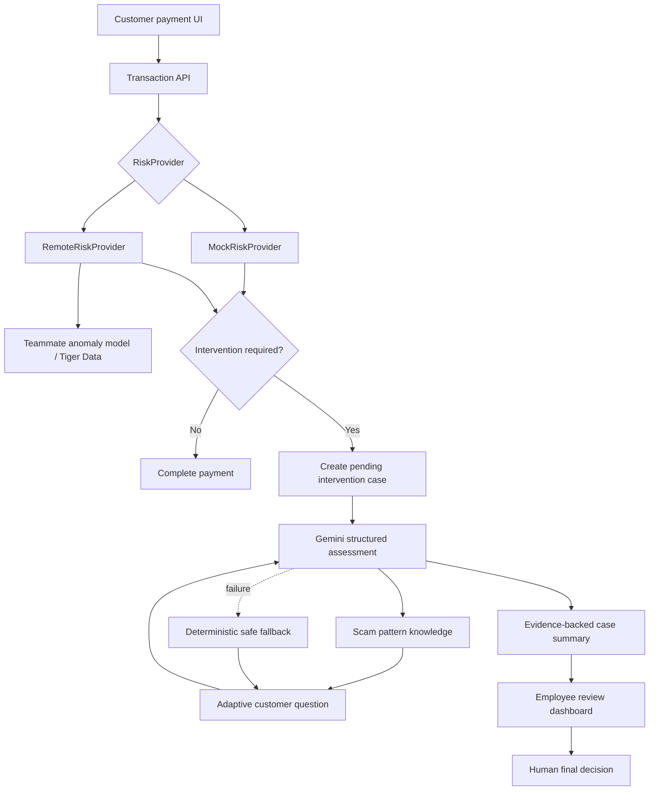

# Guardian — AI Scam Intervention Prototype

Guardian is a polished hackathon prototype for a SWIVEL-enabled bank or credit union. It detects when a legitimate, authenticated customer may be sending an authorized payment under a scammer's influence, pauses the payment, asks adaptive questions, and gives a human employee an evidence-backed recommendation.

> This is a fictional RowdyHacks XII prototype. It is not an official SWIVEL product, contains no real customer data, and performs no real payments.

## The problem

Conventional fraud detection is good at asking whether somebody unauthorized took over an account. It is less effective when the real customer uses their normal device, from their normal location, but is being threatened or manipulated into sending money.

Guardian separates three things that must not be blurred together:

1. **Behavioral evidence** — amount, recipient history, device, and region.
2. **Conversation evidence** — urgency, threats, impersonation, or secrecy disclosed by the customer.
3. **AI recommendation** — advisory guidance for a human employee, never an autonomous permanent denial.

## What works

- Fictional Maria Rodriguez banking dashboard, activity, recipients, and send-money flow
- Deterministic `MockRiskProvider` for the complete demo
- Schema-validated `RemoteRiskProvider` for the teammate's statistical service
- 3-second remote timeout and explicit mock fallback
- Adaptive scam interview using server-side Gemini structured output when configured
- Reliable deterministic agent fallback when Gemini is missing, unavailable, or malformed
- Transparent local scam-pattern knowledge layer
- Employee case queue and evidence-rich case detail
- Simulated employee-only release, review, and cancellation controls
- Four explicit interview outcomes: continue asking, release, hand to a human, or escalate
- Trusted-recipient workflow where the customer can only *request* trust and an employee plus a second factor grants it
- Verified trust that lowers recipient-identity concern but never bypasses an extreme-amount anomaly
- Text-only intervention conversation, so the customer experience stays focused and accessible
- One-click demo reset
- Runtime input/model validation, safe errors, loading states, and responsive UI

## Architecture



### What the agent is and is not allowed to do

The agent's authority is deliberately asymmetric. It may **pause** a payment, **release the pause it created itself** when the customer's explanation contains no pressure, threat, or secrecy signals, and **recommend** a human review. It has no path to cancel a payment, deny funds, freeze an account, contact law enforcement, or label anyone a criminal. `CANCELLED` is reachable only through an explicit human decision, and a test asserts it (`lib/guardian/service.test.ts`).

Concretely, `INTERVIEW_OUTCOMES` in `lib/guardian/service.ts` is the complete list of ways the agent can end an interview:

| Agent `nextAction` | Case | Payment |
|---|---|---|
| `ASK_FOLLOW_UP` | stays `OPEN` | stays `PENDING_INTERVENTION` |
| `ALLOW` | `RESOLVED` / `RELEASED` | `COMPLETED` |
| `REVIEW` | `REVIEWED` | `UNDER_REVIEW` — employee confirms |
| `ESCALATE` | `ESCALATED` | `UNDER_REVIEW` — employee decides |
| *(no entry)* | — | `CANCELLED` is human-only |

## Headless Guardian integration

Guardian is a reusable intervention capability, not a feature coupled to Maria's dashboard. The reference credit-union UI calls `POST /api/v1/transactions/evaluate`, exactly as an outside bank or SWIVEL workflow would. Guardian accepts institution-neutral transaction intents for `ACH`, `CARD`, `WIRE`, `RTP`, `P2P`, `LOAN_PAYMENT`, and `INTERNAL_TRANSFER` rails, then returns `CONTINUE` or `INTERVENE` plus a case/session reference.

The core service uses injected `CustomerContextProvider`, `RecipientContextProvider`, `RiskProvider`, `TransactionRepository`, `CaseRepository`, and `DecisionNotifier` adapters. The demo uses in-memory adapters; an institution swaps those with its own core, risk, data, and webhook integrations without rewriting agent prompts or UI protocol.

Open **Integration API** in the running app to call the same API with a synthetic partner bank, customer, mobile channel, and wire transfer. The full versioned contract is in [docs/GUARDIAN_INTEGRATION.md](docs/GUARDIAN_INTEGRATION.md).

## Quick start

Requirements: Node.js 20.9+ (Node 22 recommended).

```bash
npm install
copy .env.example .env.local
npm run dev
```

Open [http://localhost:3000](http://localhost:3000). API keys are optional; the complete demo works without them.

For production-style validation:

```bash
npm run typecheck
npm run lint
npm test
npm run build
npm start
```

## Environment variables

| Variable | Required | Purpose |
|---|---:|---|
| `RISK_PROVIDER` | No | `mock` (default) or `remote` |
| `RISK_ENGINE_URL` | Remote only | Teammate service base URL |
| `RISK_ENGINE_TIMEOUT_MS` | No | Default `3000` |
| `RISK_FALLBACK_TO_MOCK` | No | Default `true`; explicitly logs fallback |
| `GEMINI_API_KEY` | No | Enables live Gemini adaptive assessment |
| `GEMINI_MODEL` | No | Default `gemini-3.5-flash-lite` |
| `NEXT_PUBLIC_DEMO_MODE` | No | Documents explicit prototype mode |
| `GUARDIAN_API_KEY` | No | Protects the headless `/api/v1` API when set |
| `GUARDIAN_ALLOWED_ORIGIN` | No | Exact permitted browser origin for API CORS |
| `GUARDIAN_DECISION_WEBHOOK_URL` | No | Institution/SWIVEL callback after a human decision |
| `GUARDIAN_WEBHOOK_SECRET` | No | Bearer secret sent to the decision callback |

All credentials stay in server code. Never commit `.env.local`.

## The 90-second demo

1. Click **Reset demo**.
2. On Maria's dashboard, note ordinary $50–$300 activity and the recognized customer profile.
3. Click **Send money**. The form is preloaded with **$2,000 → Secure Asset Services**.
4. Submit. The mock engine scores it **82/100** because the recipient is new, the amount is extreme, and the recipient was just added—even though the device and San Antonio region are normal.
5. Answer with the suggested replies: **Yes.** → **"They said they're from the government, my account is part of a criminal investigation, I could be arrested today, and not to tell my bank."**
   Each turn offers a scam answer and a benign answer, so you can demo either path. The agent concludes as soon as it has enough evidence — usually after the second answer — so the second scam reply carries the authority claim, the threat, the deadline, and the secrecy request together.
6. Guardian recognizes authority impersonation, external instruction, threat, urgency, and secrecy, then recommends escalation. The payment remains pending.
   To demo the legitimate path instead, send **$1,500** to any new recipient and pick the benign replies — the agent clears its own hold and the payment completes.
7. Open the employee queue. Case #1042 visibly separates behavioral evidence from customer statements and the AI recommendation.
8. Use a simulated employee control to make the final decision.
9. Optional: on **Recipients**, click **Request trust** on an unverified payee, then approve it from **Trust verification requests** on the employee queue. The customer alone can never reach trusted status.

## Gemini usage

Gemini receives a dedicated system policy plus controlled snapshots produced by explicit application tools: transaction, behavioral risk, customer baseline, recipient history, case history, and the transparent pattern taxonomy. It returns a schema-constrained assessment with concern level, confidence, detected signals, one next question, rationale, and recommended action. Zod validates the result before it reaches the UI.

The model is used for the core reasoning task—choosing the next highest-value question and interpreting free-form answers—not for a cosmetic chatbot. If Gemini fails, the app openly labels the deterministic demo fallback in the employee view.

## Agent tools and boundaries

`lib/agent/tools.ts` contains narrow tools for `getTransaction`, `getBehavioralRisk`, `getCustomerProfile`, `getRecipientHistory`, `getCaseHistory`, `searchScamPatterns`, `recordCustomerAnswer`, `createCaseSummary`, and `recommendEscalation`.

These tools do not expose account freezing or final payment decisions. The agent can only ask, assess, explain, and recommend.

## Behavioral risk engine

The teammate can replace the mock with configuration only. See [docs/RISK_ENGINE_INTEGRATION.md](docs/RISK_ENGINE_INTEGRATION.md) for the exact endpoint, TypeScript contracts, payload examples, timeout, validation, and failure behavior.

Tiger Data remains behind the teammate's service. Guardian is intentionally not coupled to its database or feature implementation.

## MLH integrations

Gemini is integrated for the core adaptive assessment; Tiger Data stays behind the teammate-owned risk-engine contract. The customer experience intentionally remains text-only. Auth0, DigitalOcean, Backboard, Solana, and GoDaddy are deliberately not represented as completed integrations. See [docs/MLH_INTEGRATIONS.md](docs/MLH_INTEGRATIONS.md) for exact status, configuration, and why each decision was made.

## Roles and security

The customer/employee profile switch is an explicit local demo-role fallback, not production authentication. Auth0 was intentionally kept outside the critical demo path; production should add server-enforced `customer` and `employee` roles plus MFA. See [docs/SECURITY.md](docs/SECURITY.md).

## Privacy assumptions

Guardian does **not** read SMS, email, phone calls, WhatsApp, or social media. The behavioral engine triggers on financial-environment activity. Social-engineering context comes only from what the customer chooses to say in the intervention. The local taxonomy may be informed by public phishing research, but the product does not represent that research as access to a customer's inbox.

## Tests

Vitest covers:

- Low-risk $80 transfer to a known family member → allow/no intervention
- Signature $2,000 safe-device but anomalous recipient/amount → intervention at 82/100
- Government impersonation + arrest threat + secrecy → escalate
- Unusual but plausible daughter tuition without coercion → review
- Adaptive follow-up after another person's instruction is disclosed
- Each of the four interview outcomes maps to the right case and payment state
- A concluded interview rejects further answers (`CASE_CLOSED`)
- The agent cannot cancel a payment; only an explicit human decision can
- Headless portability: a partner institution's supplied risk model drives the same service

## Project map

```text
app/                    Next.js pages and server API routes
components/             Reusable customer, interview, and employee UI
data/scam_patterns.json Transparent social-engineering taxonomy
lib/agent/              Prompt, tools, Gemini, schema, safe fallback
lib/guardian/           Headless v1 contract, service, provider interfaces, demo adapters
lib/risk/               Mock/remote provider interface and adapters
docs/                   Integration and security documentation
```

## Future improvements

- Enforce Auth0 roles and MFA in a deployed environment
- Persist cases and append-only audit events in a real database
- Add integration tests against the teammate's deployed model
- Add multilingual intervention prompts
- Deploy only after real authentication, rate limiting, CSRF protection, audit logging, retention policy, and formal security/privacy review
