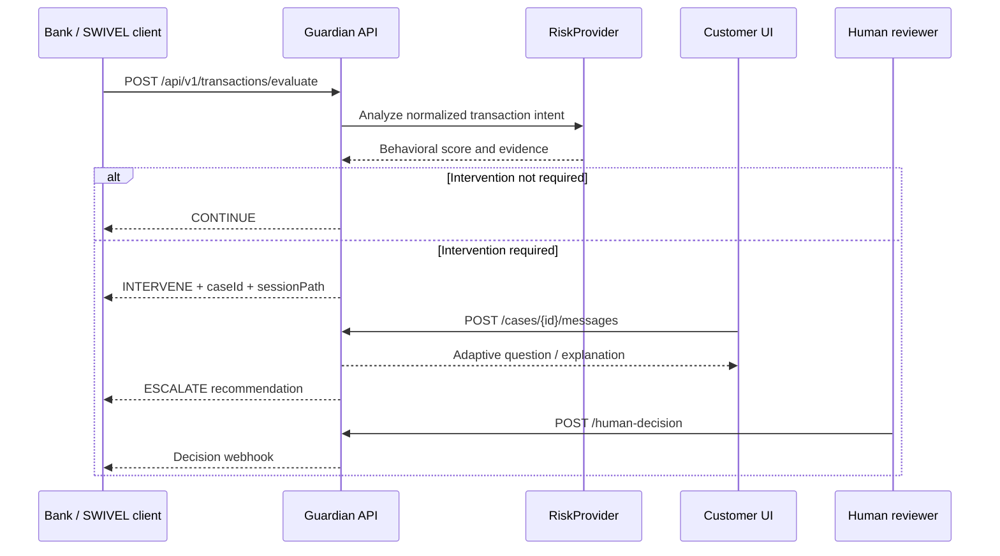

# Guardian Headless Integration Contract

Guardian is a transaction-agnostic scam-intervention service. The included Maria banking experience is a reference client, not a required part of the product.

## Integration sequence



Guardian never submits, releases, freezes, or cancels a real payment. The integrating institution remains the system of record and final decision-maker.

## Authentication and CORS

Set `GUARDIAN_API_KEY` to require `Authorization: Bearer <key>` on every `/api/v1` request. It is optional only for local hackathon demo mode. Set `GUARDIAN_ALLOWED_ORIGIN` to the exact bank/SWIVEL client origin. Do not use `*` with real customer data.

## Evaluate a transaction

```http
POST /api/v1/transactions/evaluate
Content-Type: application/json
Authorization: Bearer <GUARDIAN_API_KEY>
Idempotency-Key: partner_txn_1001
```

```json
{
  "transaction": {
    "institutionId": "partner_credit_union",
    "transactionId": "partner_txn_1001",
    "customerId": "member_2048",
    "rail": "WIRE",
    "amount": 2000,
    "currency": "USD",
    "destination": {
      "id": "recipient_900",
      "label": "Secure Asset Services",
      "type": "BUSINESS"
    },
    "channel": "MOBILE",
    "deviceId": "known_phone_7",
    "region": "san_antonio",
    "memo": "Account protection",
    "metadata": {}
  }
}
```

Supported rails are `ACH`, `CARD`, `WIRE`, `RTP`, `P2P`, `LOAN_PAYMENT`, and `INTERNAL_TRANSFER`. Supported channels are `WEB`, `MOBILE`, `BRANCH`, `CALL_CENTER`, and `IVR`.

The institution may optionally provide `customerContext`, `recipientContext`, or a fully calculated `behavioralRisk`. Otherwise, the configured providers retrieve or calculate them.

### Continue response

```json
{
  "contractVersion": "1.0",
  "institutionId": "partner_credit_union",
  "transactionId": "partner_txn_1001",
  "outcome": "CONTINUE",
  "transactionStatus": "COMPLETED",
  "risk": {},
  "intervention": null
}
```

### Intervention response

```json
{
  "contractVersion": "1.0",
  "institutionId": "partner_credit_union",
  "transactionId": "partner_txn_1001",
  "outcome": "INTERVENE",
  "transactionStatus": "PENDING_INTERVENTION",
  "risk": {},
  "intervention": {
    "caseId": "case_1042",
    "displayId": "1042",
    "status": "OPEN",
    "sessionPath": "/intervention/case_1042",
    "firstMessage": "..."
  }
}
```

The bank can render the interview using its own UI, embed a Guardian component, or send the customer to the returned hosted session.

## Interview

```http
POST /api/v1/cases/{caseId}/messages
Content-Type: application/json

{ "message": "They said they were from the government." }
```

## Case and summary

```http
GET /api/v1/cases/{caseId}
GET /api/v1/cases/{caseId}/summary
```

The summary separates behavioral signals, customer-provided statements, conversation signals, and the advisory recommendation.

## Human decision

```http
POST /api/v1/cases/{caseId}/human-decision
Content-Type: application/json

{
  "action": "KEEP_UNDER_REVIEW",
  "decidedBy": "employee_712"
}
```

Allowed actions are `MARK_REVIEWED`, `RELEASE`, `KEEP_UNDER_REVIEW`, and `CANCEL`. This endpoint belongs in the authenticated employee workflow, never in an AI tool.

## Decision webhook

Set `GUARDIAN_DECISION_WEBHOOK_URL` and optionally `GUARDIAN_WEBHOOK_SECRET`. After a human decision, Guardian sends:

```json
{
  "event": "guardian.human_decision",
  "contractVersion": "1.0",
  "caseId": "case_1042",
  "transactionId": "partner_txn_1001",
  "action": "KEEP_UNDER_REVIEW",
  "decidedBy": "employee_712"
}
```

Production implementations should add signed webhook payloads, retries, idempotency storage, and an append-only delivery log.

## Provider adapters

Guardian business logic depends on six interfaces:

- `CustomerContextProvider`
- `RecipientContextProvider`
- `RiskProvider`
- `TransactionRepository`
- `CaseRepository`
- `DecisionNotifier`

The demo adapters use synthetic in-memory data. SWIVEL or a financial institution can replace those adapters without changing the agent, prompts, or UI protocol.
